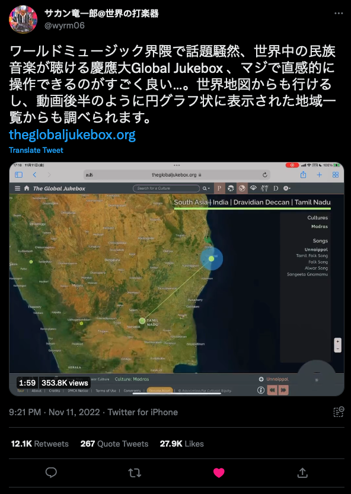

# The Global Jukebox

Recently, I was a co-author on the release paper for the Global Jukebox dataset (GJB). The GJB is a collection of 5,000+ songs from over 1,000 societies - all available to listen to only at [theglobaljukebox.org](theglobaljukebox.org). The published article [is available at PLOS One](https://journals.plos.org/plosone/article?id=10.1371/journal.pone.0275469).

Alongside the audio recordings, the GJB contains a number of expertly coded datasets containing information on the musical style, coordination of musicians (between vocalists, between instrumentalists and the relationship between the vocalists and instrumentalists), the breathing patterns in songs, the vowel and consonant patterns in singing, as well as some bibliographic datasets on instruments and musical ensembles. My role was to organise and clean these datasets into useful formats for future users - which I did utilizing the common linguistic dataset format [CLDF](https://cldf.clld.org/). All the datasets can be found saved on Github at the address [www.github.com/theglobaljukebox/](www.github.com/theglobaljukebox/). Each dataset is also versioned on Zenodo which is linked within each repository. 

Since music is so prevalent in everyday life, there was great interest in the global variance of music that the GJB openly provides. This page documents some of the media interest for this papers release. 

Press releases:

* [伝統芸能データベース「Global Jukebox」の公開－1,026民族を代表する、5,776件の音声記録がインタラクティブに利用可能－](https://www.keio.ac.jp/ja/press-releases/2022/11/10/28-133344/)
* ["Global Jukebox" Performing Arts Database Now Publicly Available: Data Made Available for Interactive Collection of 5,776 Recordings, Representing 1,026 Societies](https://www.keio.ac.jp/en/press-releases/2022/Nov/4/49-133250/)

## Famous in Japan

The Global Jukebox was well received in Japan [receiving 354.8k views, 27.9k likes and 12.4k retweets on twitter](https://twitter.com/wyrm06/status/1591013207992590336?s=20&t=zmx2L0pT58lUHqJ4-Gr3fg) after a review of the site was posted by Japanese musician Ryūichirō Sakan. 

# Other media

The press release was also picked up by various English, German, and Spanish media. A few of those links are below:

* [Phys.org: "Global Jukebox" performing arts database now publicly available](https://phys.org/news/2022-11-global-jukebox-arts-database-publicly.html)
* [Deutschlandfunk Nova: Globale Jukebox mit Tausenden traditionellen Liedern](https://www.deutschlandfunknova.de/nachrichten/globale-jukebox-datenbank-mit-tausenden-traditionellen-liedern-erstellt)
* [La Razon: La rockola del planeta: permite escuchar canciones de más de 1.000 culturas](https://www.larazon.es/tecnologia/20221102/dgn7icuf2jf5ln72oywgk5zawa.html)
* [National Endowment for the Arts: Classifying Songs and Societies to Promote Cultural Equity—Can It Be Done?](https://www.arts.gov/stories/blog/2023/classifying-songs-and-societies-promote-cultural-equity-can-it-be-done)

# Earlier Coverage

The Global Jukebox had been in preparation for some time before the formal release. Here is some earlier media coverage:

* Russonello, G. (2017, July 11). [The unfinished work of Alan Lomax’s Global Jukebox. New York Times.](https://www.nytimes.com/2017/07/11/arts/music/alan-lomax-global-jukebox-digital-archive.html)
* Chow, A. R. (2017, April 18). [Alan Lomax recordings are digitized in a new online collection. New York Times.](https://www.nytimes.com/2017/04/18/arts/music/alan-lomax-recordings-the-global-jukebox-digitized.html)
* Paul Zollo. (2020, April 6). [Global Jukebox offers free music from around the world. American Songwriter.](https://americansongwriter.com/global-jukebox-free-world-music/)
* Reed, R. (2017, April 19). [Hear music from 1,000 cultures on massive Alan Lomax recordings site. Rolling Stone.](https://www.rollingstone.com/music/music-news/hear-music-from-1000-cultures-on-massive-alan-lomax-recordings-site-109086/)
* Grant, C. (2015, January 29). [Sounding the Global Jukebox: We owe Alan Lomax a debt of thanks. The Conversation.](https://theconversation.com/sounding-the-global-jukebox-we-owe-alan-lomax-a-debt-of-thanks-36206)

**Citation**

Wood, A. L. C., Kirby, K. R., Ember, C. R., Silbert, S., **Passmore, S.**, Daikoku, H., … Savage, P. E. (2022). The Global Jukebox: A public database of performing arts and culture. PLOS ONE, 17(11), e0275469. https://doi.org/10.1371/journal.pone.0275469

