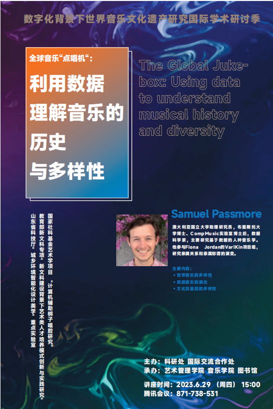

I recently gave two talks in Shandong, China and in Seoul, Korea (via Zoom). 

In these talks I discussed research I had done with Patrick Savage on the Global Diversity of music. Both of these projects utilized data from the Global Jukebox, which you can [interact with here](www.theglobaljukebox.org), or [read about here](https://journals.plos.org/plosone/article?id=10.1371/journal.pone.0275469).

At these events I discussed the outcomes of two projects. First, can we understand the extent of global musical diversity by examining songs and musical styles that appear to be outliers. This project tries to combine a qualitative understanding of outliers, with a systematic understanding of why musical styles might become very different from their neighbors. This project has just been published in the Journal of Cognition, and I will write more about it shortly. 

The second project similarities in musical style can tell us anything about the cultural histories of human society. This project finds that there is some autocorrelative features in music, but they do not seem to bare any resemblance to patterns of linguistic or genetic history. This raises the question of how does music evolve over time, and what can it tell us about the complexities of human history. This project is still under review, but you can see a [pre-print here](https://psyarxiv.com/pty34/).

[Music, Math, and Language Workshop jointly hosted by Chosun University and Korea Institute for Advanced Study (Seoul, Korea)](https://sites.google.com/view/music-math-language/program?authuser=0)

Below is a poster for my talk for the International Academic Communication Month on Computational Analysis of World Traditional Music, hosted by the Shandong College of Arts (Shandong, China)..
